# VRCXの入り方

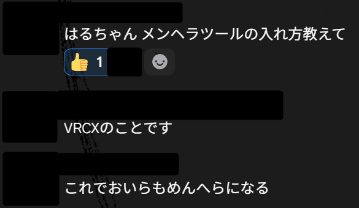

##  ダウンロードとインストール

### まずはここにVRCXをダウンロード:　https://github.com/vrcx-team/VRCX/releases/latest

下までスクロールして、『Setup.exe』で終わるものが目的のものです。

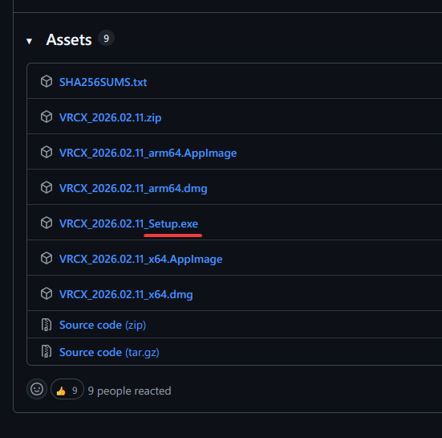

ダウンロード終わったら、インストーラ実行しよう。

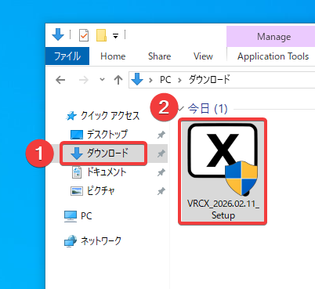

インストールのステップ、全部Nextしたらいい。

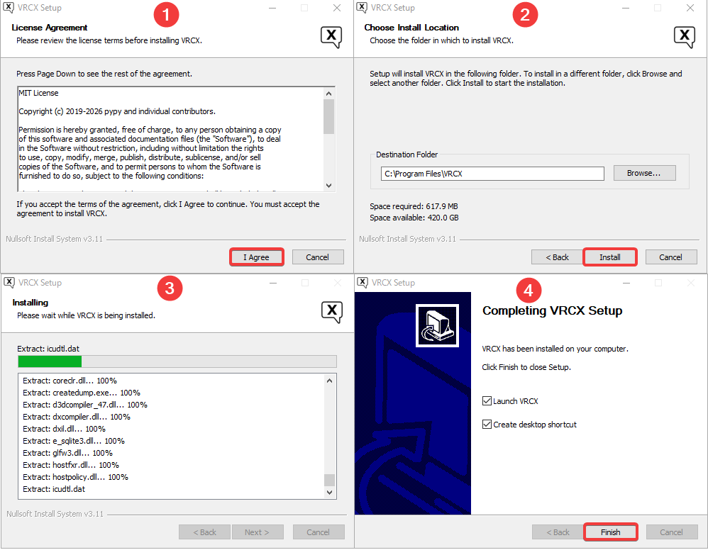

ログイン画面、ユーザーネームはアバターアップロードする時と同じ、最初の名前だよ。ログインできないならメールアドレスも試してみてね。

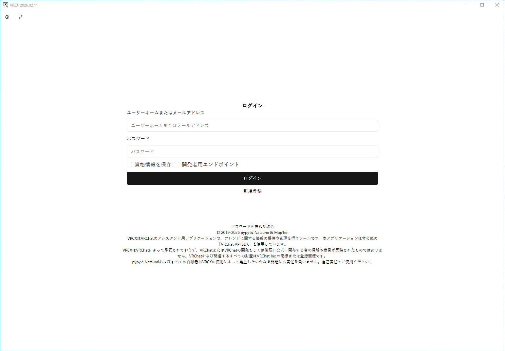

> 二段階忘れないでね    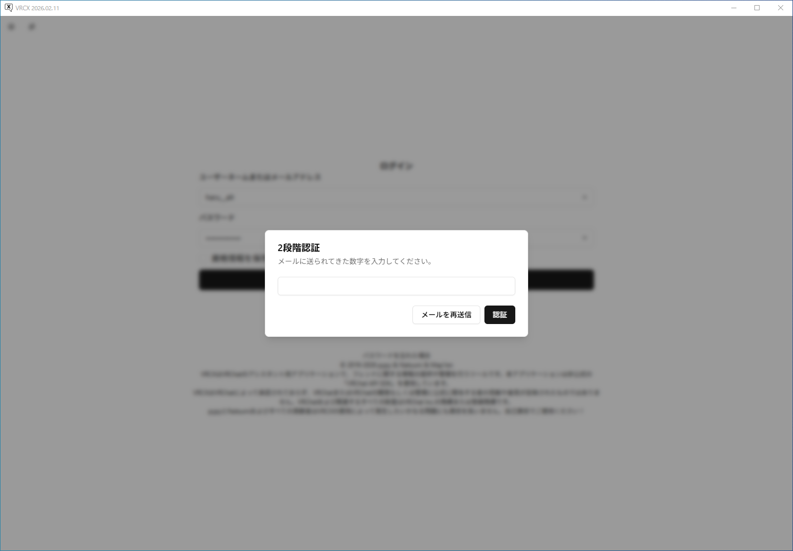

## 初めての出会い、眩しい

ログインしたらこんな感じ、明るいね。左下に**テーマを切り替え**してみよう。

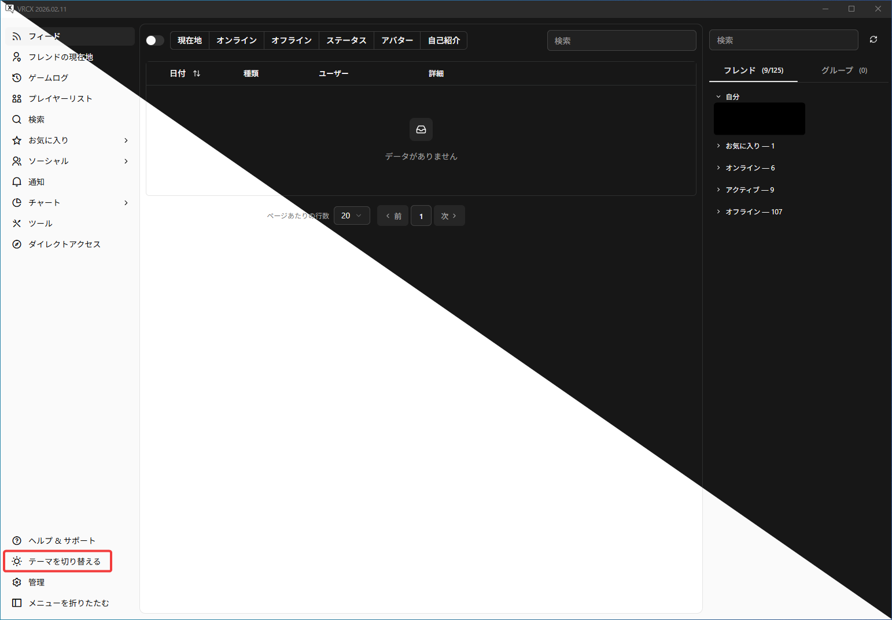

## ジョインしてくる人が先に分かるやつ

まずは　**"管理"** → **"設定"** → **"通知"**　に行く。

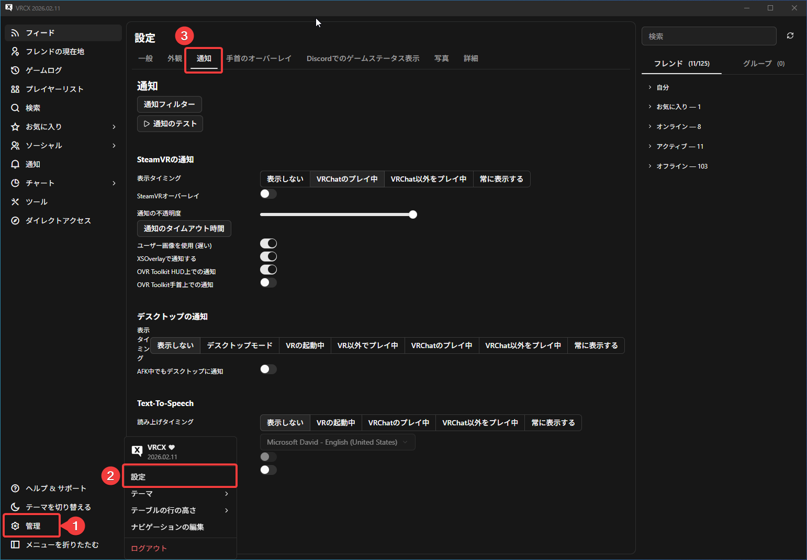

*XSOverlay*、*OVR Toolkit* **持ってない**場合、**"SteamVRオーバーレイ"** と **"通知オーバーレイ"** をオンにする。

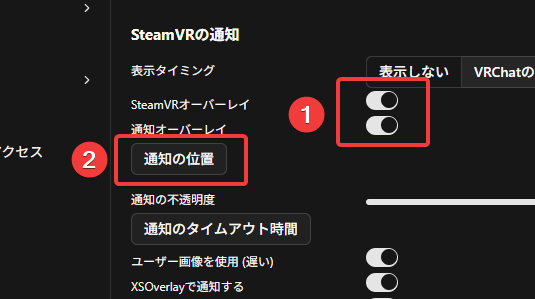

通知の位置開く、自分が好きな位置を選ぶ。俺は右上がすき。

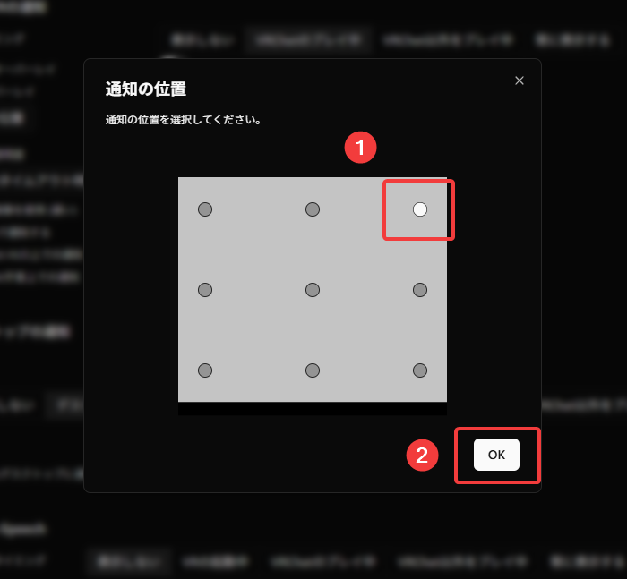

最後は一番大事な　**"通知フィルター"**

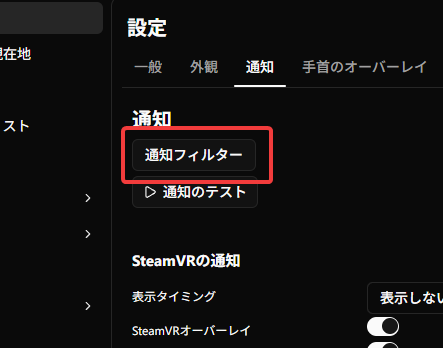

スイッチが多いですね。

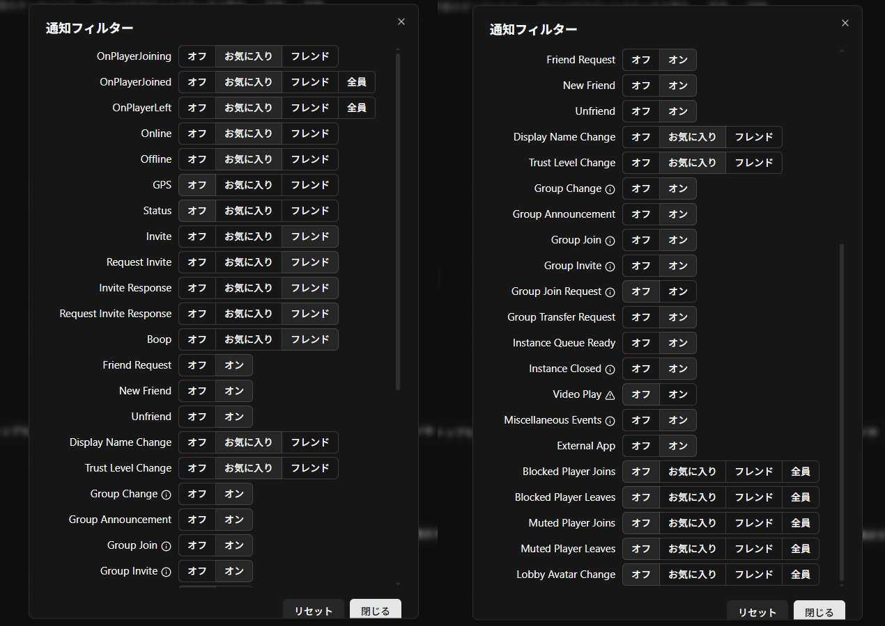

### スイッチだちの意味：

| 項目                      | 意味                                           |
|-------------------------|----------------------------------------------|
| OnPlayerJoining         | 誰かインスタンスに入るとき                                |
| OnPlayerJoined          | 誰かインスタンスに入ったとき                               |
| OnPlayerLeft            | 誰かインスタンスに抜けたとき                               |
| Online                  | 誰かオンラインしたとき                                  |
| Offline                 | 誰かオフラインしたとき                                  |
| GPS                     | 誰かの場所変わるとき                                   |
| Status                  | 誰かのステータスが変わったとき                              |
| Invite                  | 招待（こっちのインスタンスに入ってほしい）                        |
| Request Invite          | 招待リクエスト（君のインスタンスに入りたい）                       |
| Invite Response         | 招待への応答                                       |
| Request Invite Response | 招待リクエストへの応答                                  |
| Boop                    | ブープ（ジャンプスケアしたのはだれー？）                         |
| Friend Request          | フレンド申請来たとき                                   |
| New Friend              | 新しいフレンドできた／フレンド申請の応答                         |
| Unfriend                | 誰かフレンド解除されたとき                                |
| Display Name Change     | 誰の名前変えたとき                                    |
| Trust Level Change      | 誰かNew User/User/Known/Trusted/Nuisanceになったとき |
| Group Change            | グループの変更＊１                                |
| Group Announcement      | グループからの告知                                    |
| Group Join              | グループ参加リクエストが承認されたとき                          |
| Group Invite            | 誰かがあなたをグループに招待したとき                           |
| Group Join Request      | あなたがモデレーターを務めるグループに、誰かが参加申請を送ったとき            |
| Group Transfer Request  | グループ移行リクエスト（わからん）                            |
| Instance Queue Ready    | インスタンス待機完了、入れるとき                             |
| Instance Closed         | 現在いるインスタンスが閉じられ、新規参加ができなくなったとき               |
| Video Play              | VRCXのYouTube APIオプションを有効にする必要があります           |
| Miscellaneous           | VRCのゲームログに記録されるその他のイベント＊２                      |
| External App            | 外部アプリの通知（？）                                  |
| Blocked Player Joins    | ブロックしたプレイヤーかインスタンスに入ったとき＊３                     |
| Blocked Player Leaves   | ブロックしたプレイヤーかインスタンスに抜けたとき＊３                     |
| Muted Player Joins      | ミュートしたプレイヤーかインスタンスに入ったとき＊３                     |
| Muted Player Leaves     | ミュートしたプレイヤーかインスタンスに抜けたとき＊３                     |
| Lobby Avatar Change     | ロビーアバターの変更（？）                                |

> ＊１ 自分が***グループから脱退した***、***キックされた***場合、***グループ名の変更***、***グループオーナーの変更***、***役職の追加***・***削除が行われたとき***

> ＊２ 例：***VRCクラッシュ後の自動再参加***、***シェーダーキーワード制限***、***マスターによるインスタンス参加ブロック***、***動画読み込みエラー***、***オーディオデバイス変更***、***インスタンス参加エラー***、***インスタンスからのキック***、***OSCサーバーの起動失敗***、など。

> ＊３ Blocked、Muted関連のやつは***あっまり効果無い***から気にしないでね

好きに選んでOKです。おれの設定です：

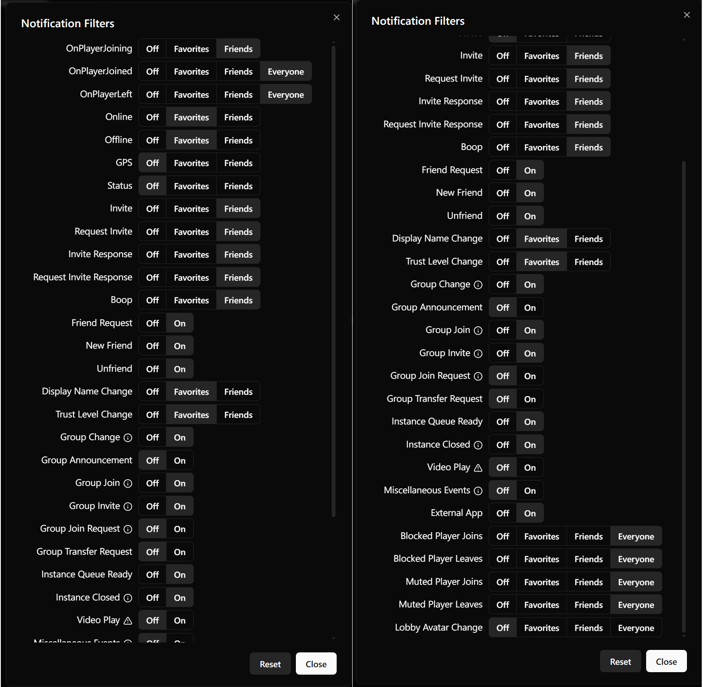

### 効果

ヘットセット付けて、VRChatにはいって、通知が来たらこんな感じです：

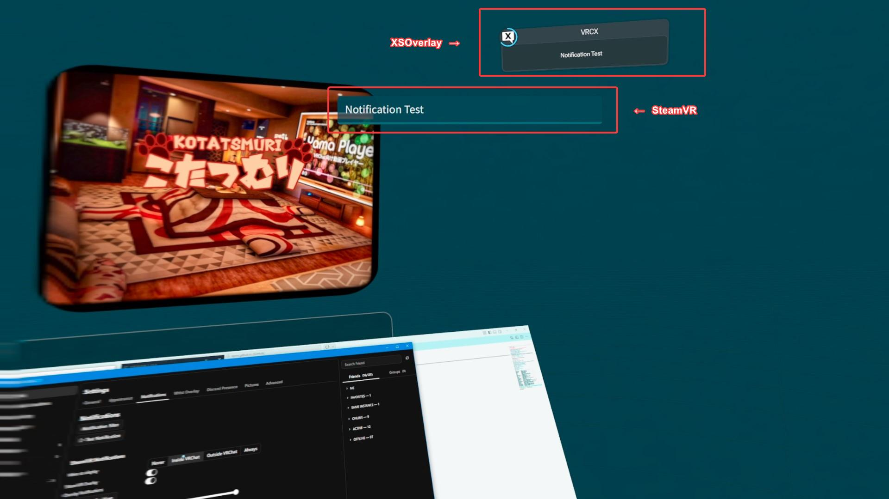

## おわり

* SteamVRオーバーレイの通知くるのは遅い、どうしよう？
  * XSOverlay買ってください。全部解決できるから。ガチで。

* 他の機能は？メンヘラストーカーになりたいー！
  * 自分で探索しろ
  * このページまた更新するかも...知らんけど。